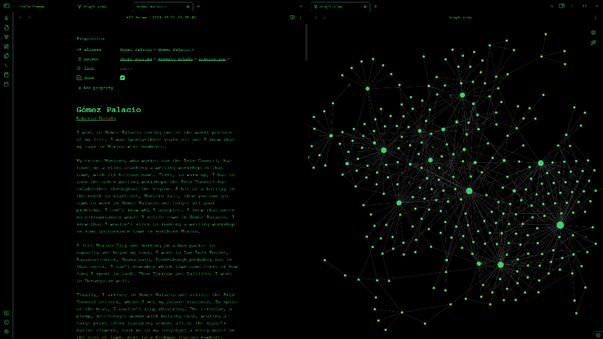

# Tom's Theme
 A simple theme for Obsidian.md to help you focus on what's important: writing

# Features
- Inspired by hacker movies and video games
- Dark mode and Light mode, though I prefer dark mode
- Background set to black
- Game Boy green themed text color, borrowed from [GB Studio](https://www.gbstudio.dev/docs/assets/backgrounds)
- File width reduced to 520px wide, to reduce line length to optimal 54 characters per line. This is the same amount of characters allowed in a GB Studio DMG mode dialogue box.
- Theme.css is commented, in case you want to make your own theme!
- Released under MIT License

